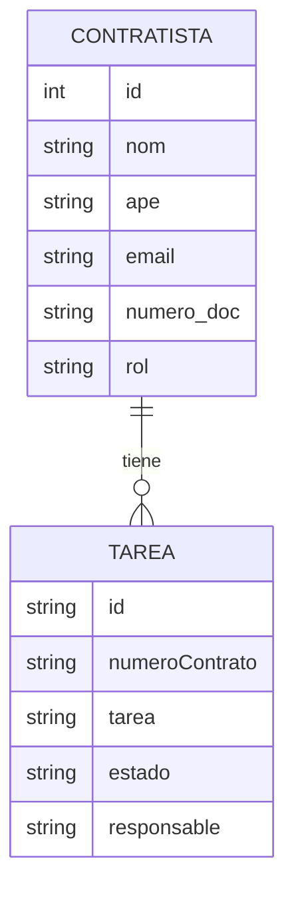
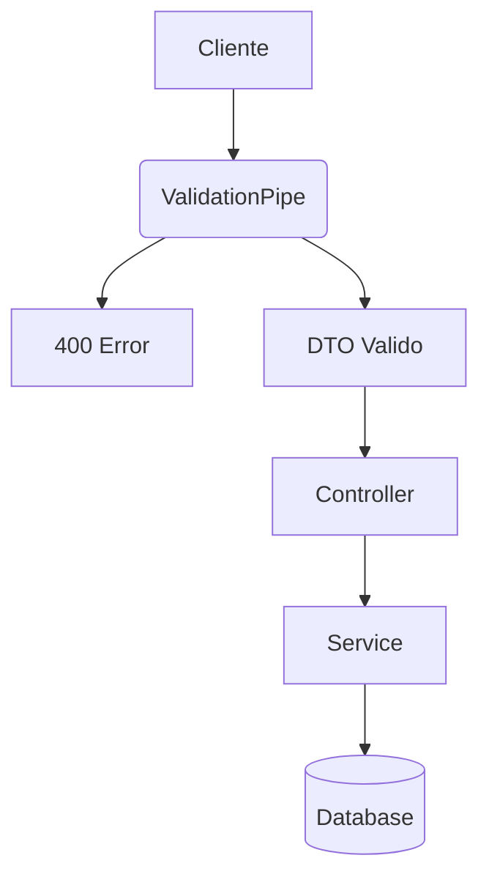
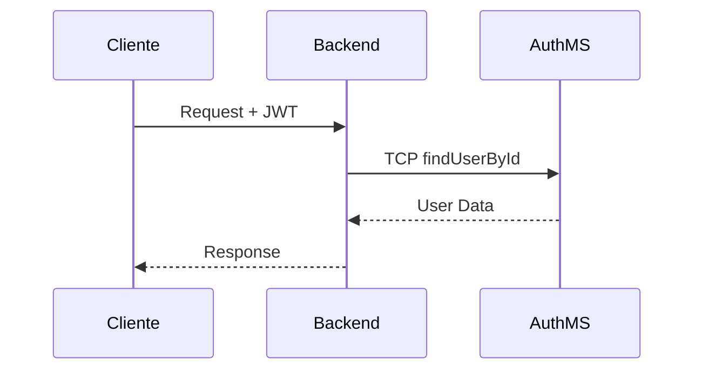
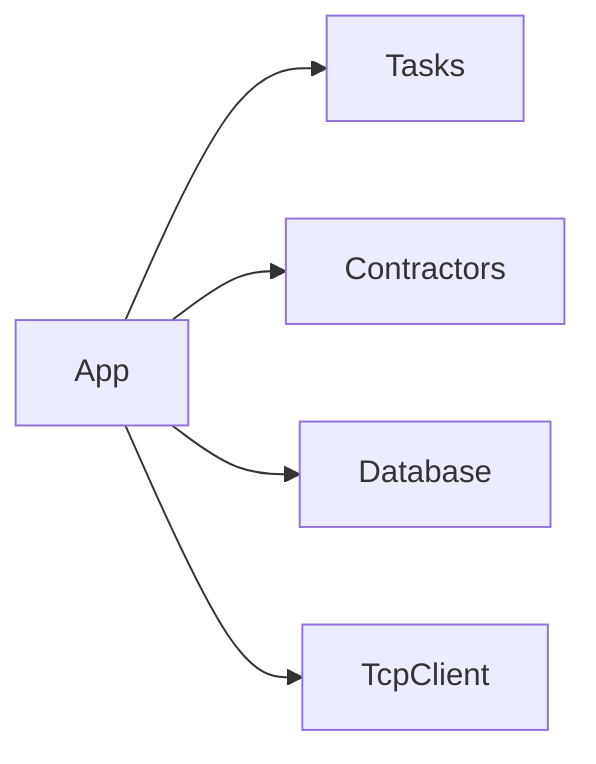

# Arquitectura y Documentación Técnica

Este documento describe la estructura y los flujos del backend.

## 1. Modelo de Datos (ERD)

## 2. Flujo de Validación

## 3. Autenticación (Microservicio)

## 4. Estructura de Módulos

## 5. Tecnologías

- **Framework:** NestJS
- **ORM:** TypeORM
- **Base de Datos:** PostgreSQL
- **Comunicación:** TCP
- **Validación:** Class-Validator
