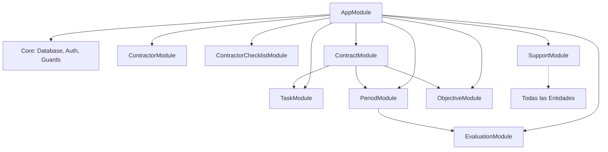

# Arquitectura y Documentación Técnica - Sistema BPO Backend

Este sistema es el núcleo de gestión para contratistas, contratos y evidencias del ecosistema BPO. Está diseñado bajo una arquitectura de microservicios (en este caso el módulo de contratos) que se integra con un sistema de autenticación centralizado.

## 1. Modelo de Datos Relacional (ERD)

El sistema utiliza **PostgreSQL** para garantizar la integridad referencial y permitir consultas complejas sobre el ciclo de vida del contrato.

```mermaid
erDiagram
    CONTRATISTA ||--o{ CONTRATO : "firma"
    CONTRATISTA ||--o{ LISTA_CHEQUEO : "gestiona"
    CONTRATISTA ||--o{ SOPORTE : "sube"
    
    CONTRATO ||--o{ TAREA : "contiene"
    CONTRATO ||--o{ PERIODO : "se divide en"
    CONTRATO ||--o{ OBJETIVO : "define"
    CONTRATO ||--o{ SOPORTE : "asocia"
    
    PERIODO ||--o| EVALUACION : "se califica en"
    PERIODO ||--o{ SOPORTE : "justifica"
    
    TAREA ||--o{ SOPORTE : "evidencia"
    OBJETIVO ||--o{ SOPORTE : "cumple"

    CONTRATISTA {
        int id
        string numero_doc
        string nom
        string email
    }
    CONTRATO {
        uuid id
        string numero_contrato
        date fecha_inicio
        date fecha_fin
    }
    PERIODO {
        uuid id
        string numero_periodo
        date fecha_inicial
        date fecha_final
    }
    EVALUACION {
        uuid id
        string responsable
        string porcentaje_evaluado
    }
    SOPORTE {
        uuid id
        string filename
        string mimetype
        string url
        boolean revisado
    }
```



## 2. Estructura de Módulos

La aplicación sigue una arquitectura modular en NestJS, facilitando la escalabilidad y el mantenimiento independiente de cada recurso.



## 3. Seguridad y Autenticación

El sistema implementa un esquema de seguridad basado en **JWT (JSON Web Tokens)**:
- **JwtAuthGuard Personalizado:** Ubicado en `src/core/guards/jwt-auth.guard.ts`. Maneja la validación de tokens y lanza excepciones específicas como `SESSION_EXPIRED`.
- **Registro de Auditoría:** Cada intento de acceso (exitoso o fallido) se registra mediante el sistema de logs, incluyendo el ID del usuario y el error detectado.
- **Protección Global:** Todos los controladores de recursos requieren un token válido en el header `Authorization: Bearer <token>`.

## 4. Gestión Documental (Soportes)

El módulo de Soportes es polimórfico y permite adjuntar evidencias a múltiples niveles:
- **Almacenamiento:** Los archivos físicos se almacenan localmente en la carpeta raíz `/uploads/supports`.
- **Nomenclatura:** Se utiliza UUID para renombrar los archivos y evitar duplicados o sobreescritura.
- **Metadata:** Se almacena el `mimetype`, `size` y `originalName` para permitir descargas precisas.
- **Revisión:** Flujo integrado de `revisado` / `rechazado` para el control de calidad de las evidencias.

## 5. Observabilidad y Logs

Implementado con `nestjs-pino`:
- **Formatos:** JSON en archivos para procesamiento automático y texto legible en consola para desarrollo.
- **Rotación:** Los logs se rotan diariamente y se almacenan en la carpeta `/logs`.
- **Trazabilidad:** Cada petición HTTP incluye un ID único de log para seguir el flujo de una operación de principio a fin.

## 6. Stack Tecnológico y Librerías

### Core
- **Framework:** [NestJS](https://nestjs.com/) v10 (Node.js)
- **Lenguaje:** TypeScript
- **Base de Datos:** PostgreSQL
- **ORM:** TypeORM

### Librerías Principales
- **`@nestjs/swagger`:** Generación automática de documentación OpenAPI.
- **`@nestjs/typeorm` & `pg`:** Integración y driver para PostgreSQL.
- **`class-validator` & `class-transformer`:** Validación y transformación de DTOs.
- **`nestjs-pino` & `pino-pretty`:** Sistema de logging de alto rendimiento.
- **`multer`:** Middleware para el manejo de `multipart/form-data` (subida de archivos).
- **`uuid`:** Generación de identificadores únicos para archivos y entidades.
- **`passport-jwt`:** Estrategia de autenticación mediante tokens.

## 7. Configuración de Entorno (`.env`)

Para ejecutar el proyecto, asegúrese de tener configuradas las siguientes variables en su archivo `.env` o `.env.local`:

```bash
# Servidor
PORT=3000
NODE_ENV=development

# Base de Datos PostgreSQL
DB_HOST=localhost
DB_PORT=5432
DB_USERNAME=postgres
DB_PASSWORD=tu_contrasena
DB_NAME=contratos_db

# Configuración de JWT (Debe coincidir con auth-ms)
JWT_SECRET=tu_secreto_super_seguro
JWT_EXPIRES_IN=24h

# Rutas de Archivos
UPLOAD_LOCATION=./uploads/supports
```
