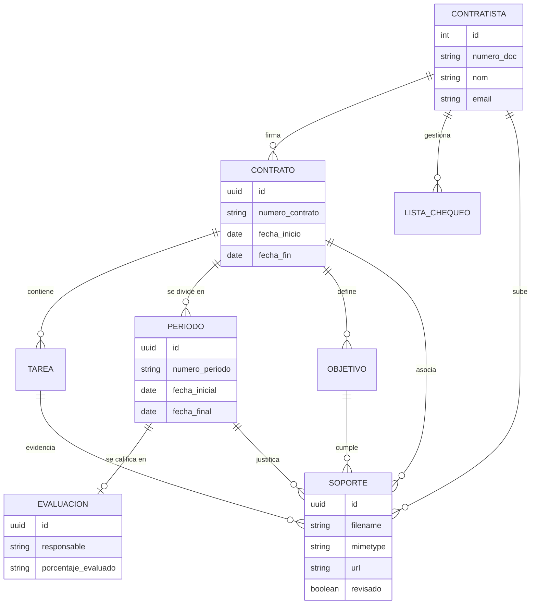
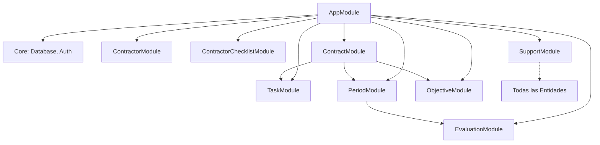

# Arquitectura y Documentación Técnica - Sistema BPO Backend

Este documento describe la estructura, flujos y el modelo de datos del backend para la gestión de contratistas y contratos.

## 1. Modelo de Datos Relacional (ERD)

El sistema utiliza PostgreSQL como base de datos relacional para garantizar la integridad y trazabilidad de la información contractual.

## 2. Estructura de Módulos

La aplicación sigue una arquitectura modular en NestJS, donde cada recurso es independiente pero está interconectado mediante relaciones de TypeORM.

## 3. Flujo de Gestión Documental (Soportes)

1.  **Carga:** Los archivos se suben vía `POST /support/upload` asociándolos a un `contratistaId` y opcionalmente a otras entidades (`contratoId`, `tareaId`, etc.).
2.  **Almacenamiento:** El archivo físico se guarda en `./uploads/supports/` con un nombre único (UUID).
3.  **Trazabilidad:** La base de datos guarda la metadata y la URL de acceso.
4.  **Aprobación:** Los supervisores pueden marcar los soportes como `revisado` o `rechazado`.

## 4. Observabilidad y Logs

El sistema utiliza `nestjs-pino` para el registro de eventos:
- **Consola:** Formato amigable mediante `pino-pretty`.
- **Archivos:** Rotación diaria en la carpeta `/logs` mediante `pino-roll`.
- **Nivel:** Configurado globalmente para capturar errores, advertencias e información relevante de las peticiones.

## 5. Documentación de API (Swagger)

La documentación interactiva está disponible en:
- `http://localhost:3000/docs` (o el puerto configurado).
- Incluye esquemas de validación (DTOs) y ejemplos de respuestas.
