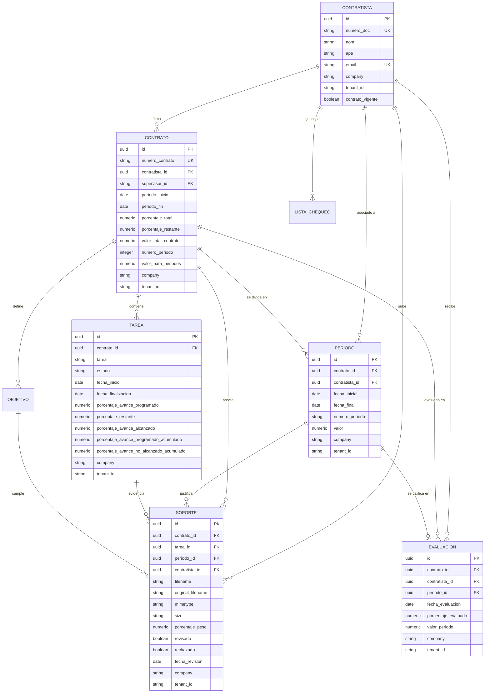
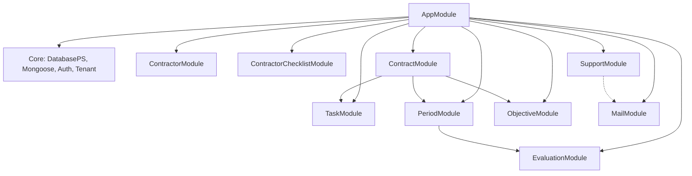

# Arquitectura y Documentación Técnica - Sistema BPO Backend

Este sistema es el núcleo de gestión para contratistas, contratos, tareas, periodos y evidencias del ecosistema BPO. Está diseñado bajo una arquitectura modular y multitenant robusta de alto rendimiento, conectándose con un microservicio de autenticación centralizado (`auth-ms`).

---

## 1. Modelo de Datos Relacional y No Relacional (Híbrido)

El backend implementa una arquitectura de base de datos híbrida para aprovechar lo mejor de ambos mundos:
1.  **PostgreSQL (Core Relacional / ACID):** Asegura la integridad referencial absoluta del ciclo de vida del contrato y maneja indexación avanzada en consultas críticas.
2.  **MongoDB (Auditoría y Configuraciones No Estructuradas):** Utilizado para el almacenamiento dinámico y log de outbox de notificaciones de correo.

### 1.1 Diagrama Entidad-Relación Relacional (ERD - PostgreSQL)

Todas las claves primarias de negocio y referencias cruzadas operan bajo el estándar **UUID (Universally Unique Identifier)** para evitar colisiones entre inquilinos.



### 1.2 Modelos de Auditoría y SMTP Dinámico (MongoDB / Mongoose)

Para habilitar notificaciones dynamic-SMTP personalizadas por inquilino y auditoría en tiempo de ejecución, el sistema define los siguientes esquemas que heredan del esquema multitenant base **`TenantBase`**:

*   **`EmailConfig` (Colección: `email_configs`):** Almacena las credenciales y configuración SMTP activa de cada inquilino.
    *   *Índice:* Único por `(company, tenantId)` para evitar múltiples configuraciones activas.
*   **`EmailOutbox` (Colección: `email_outbox`):** Cola de auditoría para registrar cada intento de correo.
    *   *Propiedades:* `to`, `subject`, `cc`, `bcc`, `body`, `status` (`pending`, `sent`, `failed`), `error`, `sentAt`.
    *   *Índice:* Compuesto en `(tenantId, company, status)`.
*   **`EmailTemplate` (Colección: `email_templates`):** Plantillas HTML tokenizadas por inquilino (`templateKey`, `subject`, `htmlContent`).
    *   *Índice:* Único por `(company, tenantId, templateKey)`.

---

## 2. Estructura de Módulos (NestJS)

La aplicación sigue una arquitectura modular y desacoplada en NestJS:



---

## 3. Seguridad y Multitenancy por Aislamiento de Hilo

El backend implementa un esquema **Multitenant de aislamiento lógico estricto** que garantiza la total privacidad y segregación de los datos entre empresas mediante los campos `company` y `tenantId` (obtenidos del token JWT de `auth-ms`).

### 3.1 Arquitectura con AsyncLocalStorage

Para evitar que los desarrolladores tengan que inyectar manualmente filtros multitenant en cada consulta SQL o servicio (lo que eleva el riesgo de fugas de datos), el sistema implementa un flujo transparente basado en la API nativa de Node.js `AsyncLocalStorage`:

1.  **`TenantContext` (`src/core/tenant/tenant.context.ts`):** Envoltura estática del `AsyncLocalStorage` que almacena y provee en tiempo de ejecución el almacén del inquilino actual (`company`, `tenantId`, `isSuperAdmin`) en el hilo de ejecución de la petición activa.
2.  **`TenantInterceptor` (`src/core/tenant/tenant.interceptor.ts`):** Interceptor global NestJS que se ejecuta tras la autenticación de `JwtAuthGuard`. Extrae las propiedades del inquilino desde `req.user` y envuelve la ejecución de la consulta dentro del contexto de `TenantContext.run()`.
3.  **Suscriptor de Grabación (`TenantSubscriber` en TypeORM):** Intercepta automáticamente todas las inserciones y actualizaciones (`beforeInsert`, `beforeUpdate`). Si el registro cuenta con campos `company` o `tenantId` y no se han asignado explícitamente, inyecta los valores extraídos del `TenantContext`.
4.  **Parche de Repositorio Global (`Tenant Patch` en TypeORM):** Parche de inicio de ciclo de vida (`src/core/tenant/tenant.patch.ts`) que altera de forma transparente los métodos `find`, `findOne`, `findAndCount` y `count` de `Repository.prototype` de TypeORM. Si la entidad relacional posee las columnas `company` y/o `tenantId` en su metadata, **anida automáticamente el filtro de inquilino** en los criterios de búsqueda `where` de la consulta, previniendo lecturas cruzadas accidentales.

---

## 4. Gestión y Auditoría de Notificaciones (`MailService`)

El módulo `MailModule` incorpora un motor dinámico, multitenant y transaccional:
*   **Transmisor SMTP Dinámico:** Al enviar un correo, el sistema consulta en MongoDB (`EmailConfig`) si existe una configuración activa de SMTP para la `company` y `tenantId` actual. Si existe, crea y despacha el email a través de ese servidor seguro dinámico; de lo contrario, realiza un **fallback** al servidor SMTP general configurado en el archivo `.env`.
*   **Log de Auditoría Atómica (Outbox):** Cada despacho de correo genera inicialmente un registro en MongoDB en estado `pending`. Si el envío es exitoso, se marca como `sent` agregando la marca de tiempo `sentAt`. Si la conexión SMTP o la red fallan, se marca como `failed` y **se captura el mensaje de error de red exacto** en la columna `error` para su auditoría y reintentos.
*   **Motor Dinámico de Plantillas:** Permite almacenar plantillas HTML en MongoDB por inquilino y clave. Procesa el asunto y cuerpo reemplazando dinámicamente marcadores en doble llave `{{ variable }}` con variables provistas en tiempo de ejecución. Cuenta con fallbacks estáticos seguros integrados en código para las claves `welcome`, `reject`, `reject_alert` y `evaluation`.

---

## 5. Indexación y Optimización de Rendimiento en PostgreSQL

Para garantizar una velocidad de respuesta óptima y prevenir escaneos de tabla secuenciales costosos en PostgreSQL a gran escala, se configuran los siguientes índices estratégicos:

1.  **Aislamiento de Inquilino:** Índice compuesto `(company, tenant_id)` en todas las entidades relacionales de negocio.
2.  **Unicidad y Búsqueda Operativa:**
    *   Índice único compuesto `(company, tenantId, templateKey)` en `EmailTemplate` de MongoDB.
    *   Índice único compuesto `(company, tenantId)` en `EmailConfig` de MongoDB.
    *   Índice único indexado en `contratistas.numero_doc` y `contratos.numero_contrato`.
3.  **Optimización de Llaves Foráneas (Relaciones):** Índices en `tareas.contrato_id`, `periodos.contrato_id`, `soportes.tarea_id`, `soportes.periodo_id`, `soportes.contrato_id`, `evaluaciones.contrato_id` y `evaluaciones.periodo_id` para resolver instantáneamente consultas relacionales complejas e integraciones de reportes.

---

## 6. Configuración de Variables de Entorno (`.env`)

Asegúrese de configurar las siguientes propiedades SMTP por defecto y conexiones no relacionales en su archivo `.env` o `.env.local`:

```bash
# Servidor
PORT=3000
NODE_ENV=development

# Base de Datos PostgreSQL
DB_HOST=localhost
DB_PORT=5432
DB_USERNAME=postgres
DB_PASSWORD=tu_contrasena
DB_NAME=contratos_db

# Base de Datos MongoDB (Auditoría y Outbox de correo)
MONGO_URI=mongodb://localhost:27017/contratos_audit_db

# Configuración por defecto de SMTP (Servidor de Fallback)
SMTP_HOST=smtp.gmail.com
SMTP_PORT=587
SMTP_SECURE=false
SMTP_USER=appsiellano@gmail.com
SMTP_PASS=siellano2020
SMTP_FROM="SIISWEB Contratos" <appsiellano@gmail.com>

# Configuración de JWT (Debe coincidir con auth-ms)
JWT_SECRET=tu_secreto_super_seguro
JWT_EXPIRES_IN=24h

# Rutas de Archivos
UPLOAD_LOCATION=./uploads/supports

# Conexión a Microservicio auth-ms
USER_MS_HOST=app.bponet.com.co
USER_MS_PORT=3011
```
