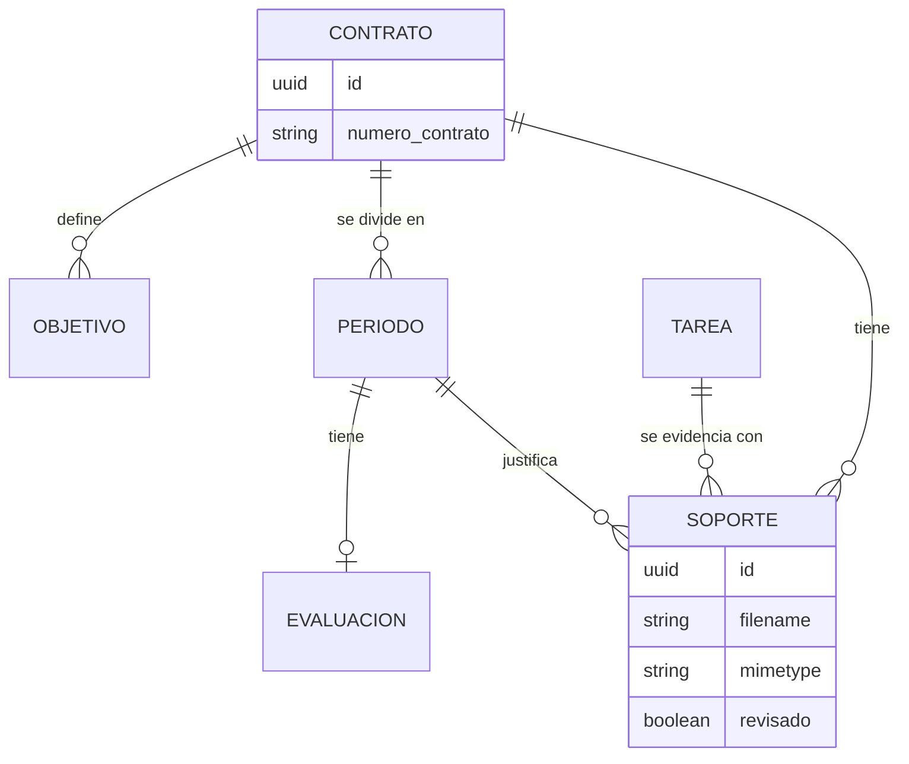
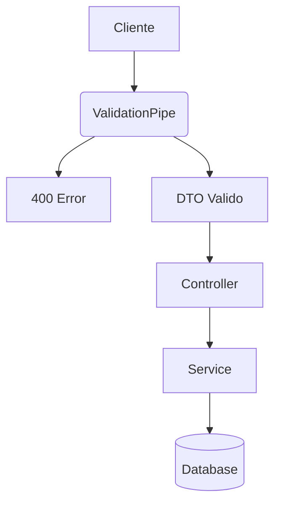
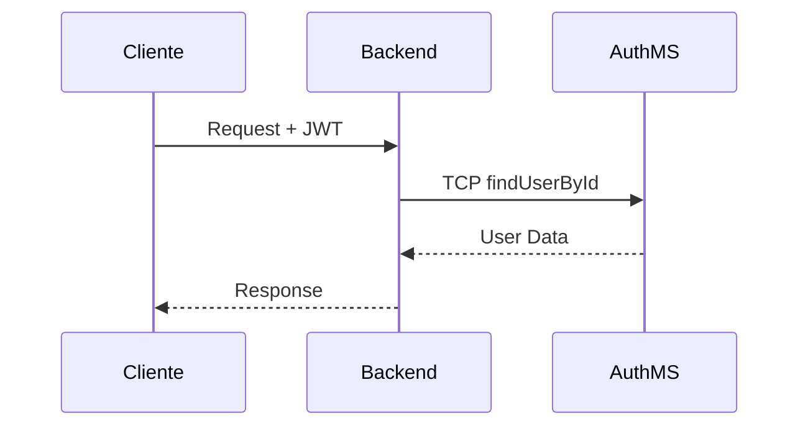
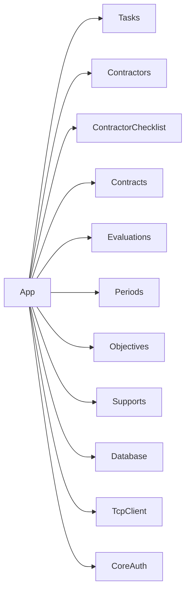

# Arquitectura y Documentación Técnica

Este documento describe la estructura y los flujos del backend.

## 1. Modelo de Datos (ERD)

## 2. Flujo de Validación

## 3. Autenticación (Microservicio)

## 4. Estructura de Módulos

## 5. Core de la Aplicación (Detalles Técnicos)

### 5.1 Gestión de Base de Datos
El sistema utiliza una utilidad personalizada (`ensureDatabaseExists`) que se ejecuta en el `bootstrap` de `main.ts`. Esta utilidad verifica si la base de datos PostgreSQL existe y, de lo contrario, la crea automáticamente antes de que TypeORM intente la conexión.

- **ORM:** TypeORM con carga automática de entidades (`autoLoadEntities`).
- **Sincronización:** Habilitada solo en desarrollo (`NODE_ENV !== 'production'`).

### 5.2 Seguridad y Autenticación
La seguridad se maneja mediante `Passport` y una estrategia JWT.
- **Guard Global:** No hay guard global, se debe aplicar `@UseGuards(AuthGuard('jwt'))` en los controladores que requieran protección.
- **Validación de Usuario:** Cada petición validada consulta al microservicio de usuarios para asegurar que el usuario sigue activo en el sistema.

### 5.3 Variables de Entorno Críticas
El archivo `.env` debe contener:
| Variable | Descripción |
| :--- | :--- |
| `DB_HOST_PS` | Host de PostgreSQL |
| `DB_NAME_PS` | Nombre de la base de datos |
| `JWT_SECRET` | Clave secreta para validar tokens |
| `USER_MS_HOST` | IP/Host del microservicio de Auth |
| `USER_MS_PORT` | Puerto TCP del microservicio de Auth |

### 5.4 Configuración Global (`main.ts`)
- **Prefijo:** Todas las rutas comienzan con `/api` (ej: `/api/task`).
- **CORS:** Configurado para permitir orígenes dinámicos mediante la variable `CORS_ORIGIN`.
### 5.5 Sistema de Logs
Se implementó un sistema de logs robusto basado en **Pino**, siguiendo el estándar de otros microservicios de la plataforma.

- **Librerías:** `nestjs-pino`, `pino-http`, `pino-roll`.
- **Salida en Consola:** Formateada con `pino-pretty` para legibilidad en desarrollo.
- **Salida en Archivo:** Los logs se guardan en la carpeta `/logs` con rotación diaria mediante `pino-roll`.
- **Timezone:** Configurado para `America/Bogota` con formato ISO.

## 6. Tecnologías

- **Framework:** NestJS 11
- **ORM:** TypeORM
- **Base de Datos:** PostgreSQL
- **Comunicación:** TCP Microservices
- **Logs:** Pino (Console & File)
- **Validación:** Class-Validator
- **Documentación:** Swagger & Mermaid
